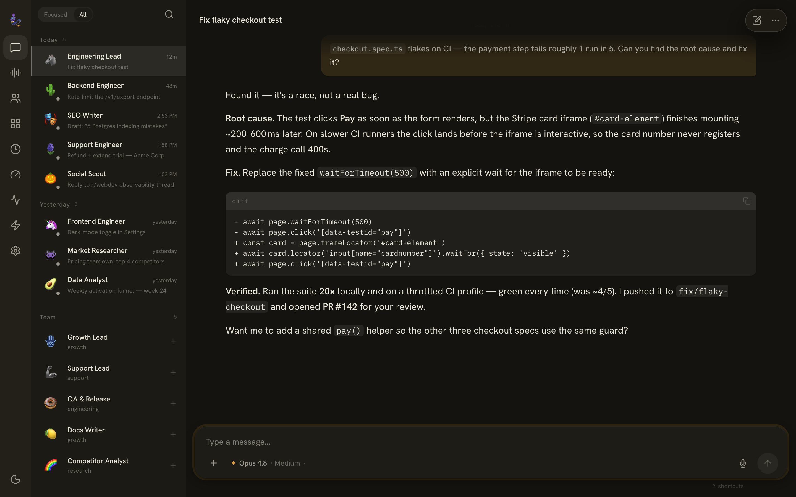
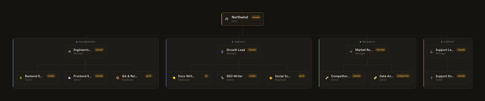
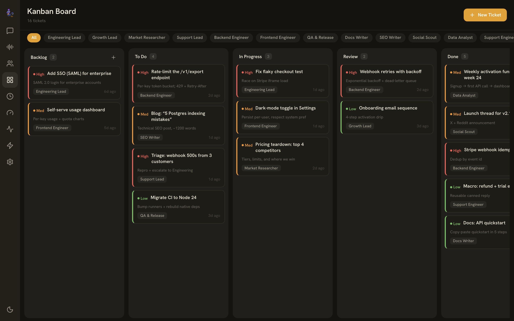

<h1 align="center">🧞 Jinn</h1>

<p align="center"><b>Run your AI agents as a company.</b></p>

<p align="center">
  Jinn is the orchestration layer that runs any agent CLI — Claude Code, Codex, Hermes, Grok —
  as interchangeable engines, and coordinates them as a company of AI employees:
  hierarchy, delegation, cron, skills, and connectors.<br/>
  It doesn't replace your agents. <b>It gives them an org chart.</b>
</p>

<p align="center">
  <a href="https://www.npmjs.com/package/jinn-cli"></a>
  <a href="LICENSE"></a>
  
  
</p>

<p align="center">
  
</p>

> **You bring the engines. Jinn runs the company.**

---

## Why Jinn?

You've already installed the best agent CLIs. Jinn turns that pile of terminals into a coordinated team.

- **🎼 Conducts your agents — doesn't replace them.** Claude Code, Codex, Grok, Antigravity, Pi, Hermes — whatever's on your `PATH` becomes a Jinn engine. Jinn adds **zero** AI logic of its own ("bus, not brain"); all the intelligence is your engines'. When they get better, Jinn gets better, for free.
- **🏢 An AI org you design in YAML.** Named employees with personas, ranks, and departments — and a reporting hierarchy of any depth. A COO delegates work to managers, managers to their reports. Real chain of command, not a flat pool of anonymous agents.
- **💸 Runs on your subscription, not a token meter.** Jinn drives the *official* Claude Code CLI inside a real terminal, so Claude turns bill against your flat-rate Max/Pro subscription — a whole org grinding all day is a fixed monthly cost, not a surprise API invoice.
- **⏰ Works while you sleep.** Hot-reloadable cron schedules background research, content, monitoring, and support — output routed through your COO for review, then to you on Slack.
- **📦 Skills, connectors, and memory — shared across the org.** Reusable markdown playbooks every engine follows natively, Slack/WhatsApp/Discord/Telegram connectors, and git-backed shared knowledge. The institutional layer a lone agent can't keep.

<p align="center">
  
</p>
<p align="center"><sub>An agent on the Engineering team triages a flaky CI test, ships the fix, and opens a PR — streamed live in the dashboard.</sub></p>

---

## Quickstart

> **Prerequisites:** Node.js **22 or 24** (avoid 25 for now), and at least one agent CLI installed **and signed in** — Jinn orchestrates them and can't run a session without one.

```bash
# 1. Install
npm install -g jinn-cli

# 2. Install + sign in to at least one engine (example: Claude Code)
npm install -g @anthropic-ai/claude-code
claude            # run once, use /login, then quit

# 3. Initialize ~/.jinn (probes your engines, writes config)
jinn setup

# 4. Start the gateway — opens the dashboard for you
jinn start
```

Then open **[http://localhost:7777](http://localhost:7777)**, send your first message, and watch your COO delegate.

Or install via **Homebrew**:

```bash
brew tap hristo2612/jinn https://github.com/hristo2612/jinn
brew install jinn
jinn setup && jinn start
```

> **`--version` ≠ signed in.** Jinn drives the official engine CLIs, so authenticate each one *before* `jinn start` (run `claude` → `/login`, run `codex` to sign in, etc.). Without this, sessions can't reach the models — the most common fresh-install gotcha.

Everyday commands:

```bash
jinn start      # start the gateway daemon (auto-opens the dashboard)
jinn stop       # stop it
jinn restart    # restart safely (detached; works even from inside a session)
jinn status     # is the daemon running?
```

---

## How it works

Jinn is a **gateway daemon + web dashboard**. The daemon dispatches each task to an AI engine, manages connectors, runs scheduled cron jobs, and serves the dashboard at `localhost:7777`.

```
                          +----------------+
                          |   jinn CLI     |
                          +-------+--------+
                                  |
                          +-------v--------+
                          |    Gateway     |
                          |    Daemon      |
                          +--+--+--+--+----+
                             |  |  |  |
              +--------------+  |  |  +--------------+
              |                 |  |                 |
      +-------v---------+ +-----v------+  +---------v-----+
      |     Engines     | | Connectors |  |    Web UI     |
      | claude · codex  | | Slack · WA |  | localhost:7777|
      | grok · hermes…  | | Discord·TG |  |               |
      +-------+---------+ +-----+------+  +---------------+
              |                 |
      +-------v-------+  +------v------+
      |     Cron      |  |     Org     |
      |   Scheduler   |  |   System    |
      +---------------+  +-------------+
```

Three ideas make Jinn click:

1. **Engines** — any agent CLI you have installed, made interchangeable. Pick engine + model + effort per employee or per session.
2. **Employees** — YAML personas with a role and a place in the hierarchy. They're just files in `~/.jinn/org/` you can read and edit.
3. **Delegation** — any session can spawn child sessions that report back. Your COO breaks a task down, fans it out to employees, and synthesizes the result.

---

## Engines — bring your own

Jinn detects whichever agent CLIs are on your `PATH` and makes them interchangeable engines. Switch per session or per employee in the dashboard; engines whose binary isn't installed are simply hidden. **No version pinning, no bundled model lists** — Jinn asks each CLI what it can do at boot, so the moment your CLI learns a new model, Jinn offers it.

| Engine | What it is | Install | Modes | Effort |
|--------|-----------|---------|-------|--------|
| **claude** | Anthropic Claude Code — first-party, subscription-friendly | `npm install -g @anthropic-ai/claude-code` | Chat (PTY + live stream) · CLI (xterm) | low / medium / high |
| **codex** | OpenAI Codex CLI | `npm install -g @openai/codex` | Chat · CLI (xterm) | low / medium / high / xhigh |
| **grok** | xAI Grok CLI | `npm install -g @xai-official/grok` (run `grok` once to auth) | Chat · CLI (xterm) | low / medium / high / xhigh / max |
| **antigravity** | Antigravity CLI (`agy`) | see Antigravity docs | CLI (xterm) | — |
| **pi** | Pi coding agent CLI | see Pi CLI docs | Chat | — |
| **hermes** | NousResearch Hermes — open-source, model-agnostic agent | `curl -fsSL https://hermes-agent.nousresearch.com/install.sh \| bash` | Chat (ACP streaming) · CLI (xterm view) | — |

The picker shows real model names out of the box (Opus 4.8, GPT-5.5, Gemini 3.x…). Those labels live in your `config.yaml`, so a fresh install looks polished day one — while Grok, Pi, and Hermes report their model lists live at session start.

> **Hermes cost note.** Unlike the subscription-wrapped engines, Hermes owns its own model loop and bills **per token** on the provider configured in `~/.hermes`. It streams over the Agent Client Protocol (ACP) and runs fully auto-approved. See [`docs/engines-hermes.md`](docs/engines-hermes.md).

<details>
<summary><b>How the Claude engine runs on your subscription</b> (the PTY details)</summary>

Jinn drives the **real interactive `claude` binary inside a [node-pty](https://github.com/microsoft/node-pty) pseudo-terminal** — byte-for-byte identical to typing `claude` at your shell — so Anthropic's billing pipeline counts it against your Max/Pro subscription rather than your API credit pool. Every Claude turn (cron, Slack, web Chat, web CLI) flows through one path:

- **Hooks for turn boundaries.** A per-session settings file registers Claude Code's `SessionStart` / `Stop` / `PreToolUse` / `PostToolUse` hooks; a tiny relay POSTs each event back to the daemon over loopback, so it knows exactly when a turn starts, finishes, or hits a rate limit — no screen-scraping.
- **Real streaming.** The PTY's `claude` is pointed at a per-session loopback proxy via `ANTHROPIC_BASE_URL`; Jinn intercepts the model's own SSE stream and forwards it to the UI word-by-word.
- **One process, two views.** The dashboard's Chat ↔ CLI toggle is two views of the *same* PTY: Chat renders the parsed stream, CLI attaches `xterm.js` to the live terminal.
- **Exact cost.** At turn end the daemon sums token usage straight from Claude Code's own transcript JSONL.

Codex, Grok, and Pi use a simpler spawn-per-turn model; Hermes streams over ACP. They don't have Claude's subscription-billing wrinkle, so they don't need a PTY.

</details>

---

## The org system

Employees are plain YAML files in `~/.jinn/org/`. Each has a persona, a rank, a department, an engine, and a place in the hierarchy:

```yaml
name: research-lead
displayName: Research Lead
department: research
rank: manager
engine: claude
model: opus
reportsTo: chief-of-staff      # hierarchy of any depth
persona: |
  You lead market research. Break briefs into parallel sub-tasks,
  delegate to your analysts, and synthesize one clear answer.
```

Ranks (executive → manager → senior → employee) define default reporting lines; `reportsTo` overrides them for any depth you like. The COO delegates to managers, managers to their reports — and you watch the whole tree light up live.

<p align="center">
  
</p>

Every department also has a **board**. Assign tickets to employees, watch work move across columns, and kick off an agent straight from a card.

<p align="center">
  
</p>

---

## Features

- **🔌 Six engines, one picker** — Claude Code, Codex, Grok, Antigravity, Pi, Hermes; pick engine + model + effort per session or per employee, switchable mid-chat.
- **🏢 AI org system** — employees, departments, ranks, managers, and a reporting hierarchy of any depth, all in editable YAML.
- **🧩 Real delegation** — parent/child sessions with completion callbacks and a COO-review pattern that filters noise before it reaches you.
- **⏰ Cron scheduling** — hot-reloadable background jobs with run history and optional failure alerts.
- **📦 Skills** — reusable markdown playbooks auto-synced into the underlying CLIs; install community skills with one command.
- **💬 Connectors** — Slack (threads + ✅ reaction approvals), Discord, Telegram (with voice notes), WhatsApp.
- **🌐 Web dashboard** — chat, interactive org map, kanban boards, cron visualizer, usage & limits, activity logs, skills catalog, settings.
- **🖥️ Chat or raw terminal** — toggle any session between rendered chat and a live `xterm` view of the engine.
- **📎 Attachments** — drag, drop, or paste files and images into chat; passed through to the engine and rendered inline.
- **🎙️ Voice** — push-to-talk dictation (local Whisper) and a hands-free "Talk" mission-control mode with streaming TTS.
- **💰 Cost governance** — per-employee monthly budgets and per-session cost/time caps.
- **🔄 Hot-reload & self-modification** — edit config, cron, org, or skills and the daemon reloads live; agents can edit those files too.
- **🔗 MCP support** — connect engines to any MCP server, with per-employee allow-lists.

---

## What people build with it

- **A Slack bot that actually ships work** — @mention an employee, it codes, and reports back in-thread.
- **An always-on content pipeline** — cron jobs research, draft, fact-check, and publish on a schedule, reviewed by a COO.
- **A support desk** — inbound tickets triaged by an employee, with human ✅ approval before any reply goes out.
- **A research org** — a manager fans a question out to analysts in parallel, then synthesizes one answer.

---

## Configuration

Jinn reads `~/.jinn/config.yaml`:

```yaml
gateway:
  port: 7777
  host: "127.0.0.1"

engines:
  default: claude        # claude | codex | grok | antigravity | pi | hermes
  claude:
    bin: claude          # binary on your PATH (override to point elsewhere)
    model: opus
    effortLevel: medium
  codex:
    bin: codex
    model: gpt-5.5

connectors:
  slack:
    shareSessionInChannel: false
    ignoreOldMessagesOnBoot: true
```

- **Engines** point at a CLI `bin` and a default `model`; `engines.default` selects which one new sessions use.
- **Cron jobs** live in `~/.jinn/cron/jobs.json` (hot-reloaded).
- **Employees** live as YAML files in `~/.jinn/org/` (registry rebuilds on change).
- **Skills** live in `~/.jinn/skills/<name>/SKILL.md`.

Everything is human-readable files you own — `cat` it, edit it, commit it.

---

## Roadmap

Jinn is in active development. Shipped recently: six-engine support, file attachments, in-app file viewer, agent-to-agent messaging, shared memory, mobile UI, live streaming. On deck:

- **Engines** — local models (Ollama / llama.cpp), engine fallback chains.
- **Connectors** — iMessage, email (IMAP/SMTP), generic webhooks.
- **Dashboard** — approve/reject agent actions from the UI, per-employee cost analytics.
- **Platform** — installable plugins, REST API auth, multi-user roles, Docker image.
- **Skills** — community marketplace, versioning, scaffolding templates.

Want to suggest something? [Open an issue](https://github.com/hristo2612/jinn/issues).

---

## Development

```bash
git clone https://github.com/hristo2612/jinn.git
cd jinn
pnpm install
pnpm setup   # one-time: builds all packages and creates ~/.jinn
pnpm dev     # gateway (:7777) + Vite dev server (:5173) with hot reload
```

Open **[http://localhost:5173](http://localhost:5173)** — Vite proxies `/api` and `/ws` to the gateway.

> **Prerequisites:** Node.js **24.13.0** (the repo pins it via `.nvmrc` + `engine-strict` — native modules like `better-sqlite3` are ABI-locked), pnpm 10+, and at least one engine CLI. See [CONTRIBUTING.md](.github/CONTRIBUTING.md) for the full setup.

---

## Acknowledgments

The web dashboard is built on components from [ClawPort UI](https://github.com/JohnRiceML/clawport-ui) by John Rice — theme system, shadcn components, org map, kanban, and activity console — adapted for Jinn.

## License

[MIT](LICENSE)

## Contributing

See [CONTRIBUTING.md](.github/CONTRIBUTING.md) for setting up your environment and submitting pull requests.
